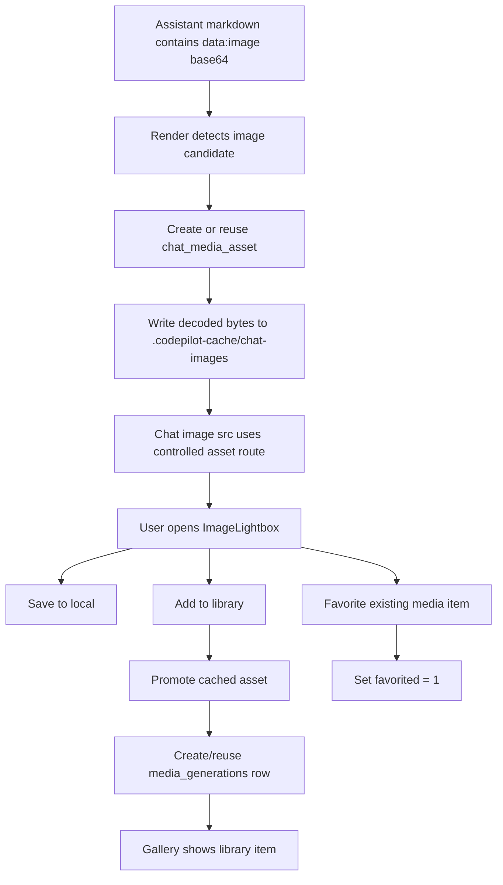

# Chat Generated Image Assets / 聊天生成图片资产化

> 创建时间：2026-06-17
> 最后更新：2026-06-17

## 状态

| Phase | 内容 | 状态 | 备注 |
|-------|------|------|------|
| Phase 0 | 设计与范围确认 | ✅ 已完成 | 用户确认按推荐方案实现 |
| Phase 1 | 聊天图片缓存资产 + 大图预览 + 收藏提升 | ✅ 已完成 | 聊天 data image 可打开大图；收藏已 smoke 到 media_generations；下载事件受 in-app browser 限制未自动捕获 |
| Phase 2 | 缩略图与缓存清理 | 📋 待开始 | 用户可在素材库列表看到缩略图；未收藏缓存可被安全清理 |

## 背景

用户通过 Joverna `gpt-image-2` 发送“生成一张海报图，主题是凤凰传奇演唱会即将在上海体育场举办，比例9:16”后，聊天模型通过 `chat/completions` 返回了完整 base64 图片。前一轮已经解决 Markdown `data:image/...;base64,...` 被 Streamdown sanitize/harden 屏蔽的问题，图片现在能显示。

新的问题是：聊天中直接渲染出来的图片不能点击查看大图；大图模式需要“保存到本地”和“收藏到素材库”。用户进一步指出，素材库不应保存 base64，而应该保存图片文件路径；聊天图片应先缓存，收藏/导入素材库后再进入正式素材库，并且素材库界面应展示缩略图、详情指向真实图片文件。

本文设计这条从“聊天内 base64 图片”到“可缓存、可预览、可导出、可收藏、可在素材库展示”的完整生命周期。

## 决策日志

- 2026-06-17: 素材库数据库不保存 base64。`media_generations` 只保存 `local_path`、`thumbnail_path`、prompt、model、tags、favorited 等元数据；图片二进制落盘。
- 2026-06-17: 聊天 Markdown data image 不直接自动进入素材库。先写入聊天缓存资产，用户点击“添加到素材库”时再 promote。
- 2026-06-17: “保存到本地”“添加到素材库”“收藏”语义分离。保存到本地是导出文件，不改变素材库；添加到素材库创建/复用 `media_generations`；收藏只更新已有素材库条目的 `favorited` 标记。
- 2026-06-17: Phase 1 不强制缩略图生成。`thumbnail_path` 和 API 响应预留；Phase 2 再引入缩略图生成和缓存 GC，避免阻塞主路径。
- 2026-06-17: Markdown 图片的 `alt` 常为 `image_1`，不能作为素材库 prompt。聊天图片资产 prompt 改为使用当前 assistant turn 对应的上一条用户消息；复用旧 asset 时若旧 prompt 是 `image_1` 这类通用占位，会用真实 prompt 修正 asset 和已关联的 `media_generations`。

## 用户可见目标

用户在聊天界面看到模型返回的图片后：

1. 点击图片可以打开大图预览。
2. 大图预览里有下载/保存到本地按钮。
3. 大图预览里有添加到素材库按钮。
4. 图片添加到素材库后能在素材库看到；已入库图片可单独收藏。
5. 素材库记录指向落盘图片文件，不把 base64 存进 DB。

## 明确不做

1. 不把所有聊天图片自动加入素材库。
2. 不把 base64 图片原文存进 `media_generations`。
3. 不开放任意本地路径给 `/api/media/serve`。
4. 不把“保存到本地”视为“收藏到素材库”。
5. Phase 1 不做历史消息批量迁移；只保证新渲染/新点击路径正确。
6. Phase 1 不做复杂图片编辑、重命名、批量标签管理。
7. Phase 1 不引入重量级图片处理依赖；缩略图生成放 Phase 2 单独评估。

## 现状

### 名词层现状

`messages` 表保存聊天消息，`content` 是文本或 JSON blocks。Markdown data image 当前位于 assistant 文本消息里，形态类似：

```markdown

```

`media_generations` 表已经存在，字段包括：

```text
id
type
status
provider
model
prompt
aspect_ratio
image_size
local_path
thumbnail_path
session_id
message_id
tags
metadata
favorited
created_at
completed_at
```

`MediaBlock` 类型已经支持：

```ts
{
  type: 'image' | 'audio' | 'video';
  data?: string;
  mimeType: string;
  localPath?: string;
  mediaId?: string;
  sourceMetadata?: { prompt?: string; model?: string };
}
```

`saveMediaToLibrary()` 会把 base64 写入 `<dataDir>/.codepilot-media/`，再创建 `media_generations` 行。`importFileToLibrary()` 会复制已有文件到 `.codepilot-media/`，再创建 DB 行。

### 编排层现状

工具结果媒体走的是结构化路径：

```text
tool_result.media
  → /api/chat 持久化时 saveMediaToLibrary()
  → MessageItem / StreamingMessage 收集 MediaBlock
  → MediaPreview 渲染
  → /api/media/serve?path=<.codepilot-media path>
```

Markdown data image 走的是文本路径：

```text
assistant text
  → MessageResponse / Streamdown
  → CHAT_MARKDOWN_COMPONENTS.img
  → 
```

这条文本路径没有资产记录、没有缓存文件、没有 `mediaId`，因此不能可靠地做素材库收藏、去重、清理、缩略图，也会让大 base64 长期滞留在消息文本里。

## 变化设计

### 名词层变化

新增聊天媒体资产表：

```sql
CREATE TABLE IF NOT EXISTS chat_media_assets (
  id TEXT PRIMARY KEY,
  session_id TEXT NOT NULL,
  message_id TEXT,
  kind TEXT NOT NULL DEFAULT 'image'
    CHECK(kind IN ('image','video','audio')),
  source TEXT NOT NULL DEFAULT 'markdown-data-url',
  mime_type TEXT NOT NULL,
  sha256 TEXT NOT NULL,
  cache_path TEXT NOT NULL,
  media_generation_id TEXT,
  prompt TEXT NOT NULL DEFAULT '',
  model TEXT NOT NULL DEFAULT '',
  metadata TEXT NOT NULL DEFAULT '{}',
  created_at TEXT NOT NULL DEFAULT (datetime('now')),
  promoted_at TEXT,
  FOREIGN KEY (session_id) REFERENCES chat_sessions(id) ON DELETE CASCADE,
  FOREIGN KEY (message_id) REFERENCES messages(id) ON DELETE SET NULL,
  FOREIGN KEY (media_generation_id) REFERENCES media_generations(id) ON DELETE SET NULL
);

CREATE INDEX IF NOT EXISTS idx_chat_media_assets_session_id
  ON chat_media_assets(session_id);
CREATE INDEX IF NOT EXISTS idx_chat_media_assets_message_id
  ON chat_media_assets(message_id);
CREATE INDEX IF NOT EXISTS idx_chat_media_assets_sha256
  ON chat_media_assets(sha256);
CREATE INDEX IF NOT EXISTS idx_chat_media_assets_media_generation_id
  ON chat_media_assets(media_generation_id);
```

目录约定：

```text
<dataDir>/.codepilot-cache/chat-images/<sessionId>/<assetId>.<ext>
<dataDir>/.codepilot-media/<timestamp>-<random>.<ext>
<dataDir>/.codepilot-media/thumbs/<mediaId>.webp   # Phase 2
```

`chat_media_assets.cache_path` 是缓存文件路径。`media_generations.local_path` 是素材库正式文件路径。两者不能混用。

MIME 白名单 Phase 1 仅支持：

```text
image/png
image/jpeg
image/webp
image/gif
```

拒绝 `image/svg+xml`、任意 `text/html`、非 base64 data URI 和未知 MIME。

### 编排层变化

主流程：



Phase 1 可采用“懒资产化”以降低风险：

```text
Markdown  首次渲染仍可显示 data URL
点击大图或添加到素材库时调用 asset API
API 将 data URL 写入 cache，并返回 assetId/contentUrl
添加到素材库时 promote asset
```

如果实现复杂度可控，优先采用“消息持久化时资产化”：

```text
/api/chat 保存 assistant message 前扫描 text blocks
抽取 data image → 写 cache → 创建 chat_media_assets
把消息文本里的 data URL 替换为 codepilot asset URL 或 asset marker
```

两者取舍：

| 方案 | 优点 | 风险 |
|------|------|------|
| 懒资产化 | 改动小；不需要立即迁移消息保存协议 | 消息里仍暂存 base64；刷新后需要再次资产化 |
| 保存时资产化 | 最终形态正确；聊天历史不再长期携带大 base64 | 需要改消息持久化和 markdown 内容替换，回归面更大 |

设计倾向：Phase 1 先做“懒资产化 + promote 幂等”，同时把服务端 helper 设计成可被 `/api/chat` 后续复用；Phase 1 验收后再决定是否将保存时资产化纳入 Phase 2 或独立迁移。

### API 设计

#### `POST /api/chat/media-assets`

把聊天中的 base64 图片写入受控缓存目录，并创建/复用 `chat_media_assets`。

请求：

```json
{
  "sessionId": "464ed794fe5eb6b26aa2e5cc4428a62a",
  "messageId": "optional-message-id",
  "mimeType": "image/png",
  "data": "<base64 or data URL>",
  "prompt": "生成一张海报图...",
  "model": "gpt-image-2",
  "source": "markdown-data-url"
}
```

响应：

```json
{
  "assetId": "asset-id",
  "mimeType": "image/png",
  "sha256": "...",
  "contentUrl": "/api/chat/media-assets/asset-id/content",
  "mediaId": null
}
```

幂等规则：

```text
same session_id + same sha256 + same source
  → 复用已有 chat_media_assets
```

如果已有资产已经 `media_generation_id` 非空，响应同时返回 `mediaId`。

#### `GET /api/chat/media-assets/[id]/content`

展示聊天缓存图。只允许读取 `chat_media_assets.cache_path` 或已 promote 后对应的 `media_generations.local_path`，不能接收任意 path query。

响应头：

```text
Content-Type: image/png | image/jpeg | image/webp | image/gif
Cache-Control: private, max-age=31536000, immutable
```

#### `POST /api/chat/media-assets/[id]/promote`

把缓存资产提升为素材库条目。这个动作不设置收藏；收藏由 `PUT /api/media/[id]/favorite` 单独负责。

响应：

```json
{
  "assetId": "asset-id",
  "mediaId": "media-generation-id",
  "localPath": "<dataDir>/.codepilot-media/...",
  "favorited": false
}
```

幂等规则：

```text
asset.media_generation_id exists
  → 返回原 mediaId 和当前 favorited 状态
asset not promoted
  → import/copy cache_path into .codepilot-media
  → create media_generations
  → update chat_media_assets.media_generation_id/promoted_at
```

#### 保留已有接口

`PUT /api/media/[id]/favorite` 继续服务素材库条目本身。聊天 lightbox 只对已知 `mediaId` 的图片调用这个接口；对只有 `assetId` 的缓存图先调用 promote 添加到素材库。

`GET /api/media/serve?path=...` 继续只服务 `.codepilot-media` 下的素材库文件。它不扩大到 cache 目录。

### UI 设计

`ImageLightbox` 继续作为共享大图组件，但图片输入要从“裸 src”升级为资产感知结构：

```ts
interface LightboxImage {
  src: string;
  alt: string;
  mimeType?: string;
  assetId?: string;
  mediaId?: string;
  data?: string;      // 仅用于懒资产化，成功后应丢弃
  prompt?: string;
  model?: string;
  filename?: string;
}
```

按钮行为：

| 按钮 | 当前图片状态 | 行为 |
|------|--------------|------|
| 保存到本地 | `mediaId` | 从 `/api/media/serve` 下载 |
| 保存到本地 | `assetId` | 从 `/api/chat/media-assets/[id]/content` 下载 |
| 保存到本地 | only `data` | 先创建 asset，再下载 |
| 添加到素材库 | `mediaId` | 已在素材库，按钮置为已添加 |
| 添加到素材库 | `assetId` | `POST /api/chat/media-assets/[id]/promote` |
| 添加到素材库 | only `data` | 先创建 asset，再 promote |
| 收藏 | `mediaId` | `PUT /api/media/[id]/favorite` |
| 收藏 | `assetId` / only `data` | 禁用；提示先添加到素材库 |

Markdown `ChatImg`：

1. 保持现有安全边界，只接收 sanitize 后的 raster base64 data image。
2. 点击图片打开 `ImageLightbox`。
3. 将 `src`、`mimeType`、`data`、`alt/prompt` 传给 lightbox。
4. 不在组件里直接写 DB；所有落盘走 API。

`MediaPreview` / `ImageGenCard`：

1. 已有 `mediaId` 的图片直接传给 lightbox。
2. 只有 `localPath` 但没有 `mediaId` 时，不应自动创建素材库记录；如果路径已在 `.codepilot-media`，服务端可按 `local_path` 查回记录。
3. 工具结果路径继续优先走 `MediaBlock.mediaId`。

素材库：

1. Phase 1 gallery 继续展示 `local_path`。
2. Phase 2 `gallery` API 返回 `thumbnailPath`/`thumbnailUrl`；`GalleryGrid` 优先展示缩略图，`GalleryDetail` 展示原图。

### 持久化与文件策略

素材库正式文件：

```text
<dataDir>/.codepilot-media/<timestamp>-<random>.<ext>
```

聊天缓存文件：

```text
<dataDir>/.codepilot-cache/chat-images/<sessionId>/<assetId>.<ext>
```

删除策略：

| 操作 | 行为 |
|------|------|
| 删除素材库条目 | 删除 `media_generations.local_path` 和 `thumbnail_path`；`chat_media_assets.media_generation_id` 通过 FK 或手动置空 |
| 删除聊天会话 | `chat_media_assets` 行级联删除；Phase 2 可删除对应 cache 文件 |
| 清理缓存 | 只删除未 promoted 且超过 TTL 的 cache 文件；已被消息引用但未 promoted 的资产不自动删，除非有可恢复 data 或用户确认 |

Phase 1 不启用自动清理；只保证缓存目录受控且可追踪。Phase 2 再加 GC。

### 错误语义

| 场景 | 用户可见结果 | 日志 |
|------|--------------|------|
| data URL MIME 不支持 | 收藏按钮禁用或 toast “不支持的图片类型” | 不打印 base64 |
| base64 解码失败 | toast “图片数据无效” | 打 asset create error，不打印 data |
| cache 文件丢失 | toast “图片缓存不存在，无法收藏” | 打 assetId/cache path |
| promote DB 写失败 | toast “收藏到素材库失败” | 打 stack，不打印用户密钥 |
| 下载失败 | fallback `window.open(src)` 或 toast | 打浏览器 console 即可 |

### 结构健康度

文件级：

`ImageLightbox.tsx` 目前已经承担预览、下载、收藏、asset 创建等职责，继续堆逻辑会偏胖。实现时应把资产 API 调用抽到新 hook 或 helper：

```text
src/hooks/useChatMediaAsset.ts
或
src/lib/client/chat-media-assets.ts
```

`media-saver.ts` 当前只面向正式素材库，职责清晰。不要把 chat cache 写入逻辑塞进 `media-saver.ts`；应新增：

```text
src/lib/chat-media-assets.ts
```

目录级：

`src/app/api/media/` 已经是素材库正式媒体 API，不适合放 chat cache。新增 API 应放：

```text
src/app/api/chat/media-assets/
```

这样能表达“这是聊天消息资产，不是素材库正式媒体”。

超出范围的观察：

`media_generations` 目前只有单 `local_path`，但部分生图流程可能一次生成多张图。这个结构性问题不在本 feature 内解决；若后续要完整支持“一次生成多图、多缩略图、多收藏状态”，应单独走 `media_assets`/`media_generation_items` 重构。

## 挂载点清单

删掉以下挂载点，这个功能在用户视角应完全消失：

1. `CHAT_MARKDOWN_COMPONENTS.img` 的 lightbox 打开能力。
2. `ImageLightbox` 中保存到本地/收藏到素材库按钮。
3. `chat_media_assets` 表和 `src/lib/chat-media-assets.ts` 服务端 helper。
4. `/api/chat/media-assets/*` API。
5. `GalleryGrid`/`GalleryDetail` 对 promoted 素材库记录的展示路径。

## 推进策略

### Phase 1: 聊天图片资产闭环

用户会看到：

```text
聊天图片可点击打开大图，大图可保存到本地，可收藏到素材库，收藏后素材库可见。
```

不做：

```text
不做自动缓存清理，不做缩略图生成，不做历史消息迁移。
```

步骤：

1. 新增 `chat_media_assets` schema + DB migration + 类型定义。
2. 新增 `src/lib/chat-media-assets.ts`，实现 MIME 校验、sha256、cache 写入、asset 复用、promote 到素材库。
3. 新增 `/api/chat/media-assets`、`/api/chat/media-assets/[id]/content`、`/api/chat/media-assets/[id]/promote`。
4. 调整 `ImageLightbox` 为资产感知组件。
5. 调整 `ChatImg` 点击打开 lightbox，并支持懒资产化。
6. 调整 `MediaPreview` / `ImageGenCard` 传递 `mediaId`/`localPath`/prompt/model。
7. 回归测试和 UI smoke。

退出信号：

```text
Joverna chat/completions 返回的 data image 点击后能打开大图；
下载按钮能导出图片文件；
收藏按钮能创建/复用 media_generations 并设置 favorited；
素材库页面能看到该图片；
DB 中 media_generations 没有 base64，只保存 local_path。
```

### Phase 2: 缩略图与缓存清理

用户会看到：

```text
素材库列表加载更轻，使用缩略图；未收藏的旧聊天缓存不会无限增长。
```

不做：

```text
不改变 Phase 1 的收藏语义；不开放任意路径读取。
```

步骤：

1. 评估图片处理方案：优先复用已有系统能力；没有合适能力时再评估轻量依赖。
2. promote 时生成 `thumbnail_path`。
3. `GET /api/media/gallery` 返回 `thumbnailPath`/`thumbnailUrl`。
4. `GalleryGrid` 优先显示缩略图，`GalleryDetail` 保持原图。
5. 新增 cache GC helper，仅清理未 promoted 且超过 TTL 的 cache asset。
6. 增加删除会话/删除素材时的文件清理一致性测试。

退出信号：

```text
素材库列表不直接请求原图；
删除素材库条目会清理原图和缩略图；
cache GC 不会删除仍被聊天引用或已用于素材库的文件。
```

## 验收契约

### 正常路径

1. 输入：assistant markdown 包含 `data:image/png;base64,<valid>`。
   期望：聊天中显示图片，点击打开大图，关闭后回到聊天。

2. 触发：在大图中点击保存到本地。
   期望：浏览器/Electron 下载流程拿到图片文件；素材库 DB 不新增记录。

3. 触发：在大图中点击添加到素材库。
   期望：创建或复用 `chat_media_assets`；创建或复用 `media_generations`；`favorited` 保持默认未收藏；素材库显示该图片。

4. 触发：图片已添加到素材库后点击收藏。
   期望：不产生重复素材库记录；只把对应 `media_generations.favorited` 设置为 `1`。

### 边界路径

1. 输入：`data:image/svg+xml;base64,...`。
   期望：仍被 markdown hardening 阻断，不能进入资产 API。

2. 输入：`data:text/html;base64,...`。
   期望：不能渲染为图片，不能保存/收藏。

3. 输入：base64 很大。
   期望：API 不把 base64 打进日志；成功时落盘，失败时 toast 明确。

4. 输入：已有 `MediaBlock.mediaId` 的工具结果图片。
   期望：lightbox 收藏直接走 `PUT /api/media/[id]/favorite`，不重复导入。

5. 输入：只有 `localPath` 且路径不在 `.codepilot-media`。
   期望：不能通过 `/api/media/serve` 读取；如需导入，必须走受控 import/promote 流程。

### 反向核对

1. 查询 `media_generations`，不应出现 base64 文本。
2. 收藏一张图片后，不应在素材库出现两条相同 `local_path` 记录。
3. `/api/media/serve?path=<cache_path>` 应拒绝，因为 cache 有自己的 content route。
4. 下载到本地不应自动设置 `favorited = 1`。

## 测试计划

单元/路由测试：

1. `chat-media-assets` helper：MIME 白名单、base64 解码、sha256 幂等、cache path 位于受控目录。
2. `POST /api/chat/media-assets`：创建/复用 asset，拒绝 SVG/HTML/非 base64。
3. `GET /api/chat/media-assets/[id]/content`：只读 DB 记录对应文件；不存在返回 404。
4. `POST /api/chat/media-assets/[id]/promote`：创建 `media_generations`、不设置 `favorited`、重复调用幂等。
5. `PUT /api/media/[id]/favorite`：已有测试继续保留。
6. Markdown hardening：现有 `chat-markdown-data-image.test.ts` 继续覆盖安全边界。

UI smoke：

1. Electron debug client 中打开 Joverna 已生成图片的聊天。
2. 点击聊天图片，大图出现。
3. 点击保存到本地，确认下载行为触发。
4. 点击添加到素材库，确认 toast 成功，按钮变为已添加。
5. 点击收藏，确认只更新收藏状态。
6. 打开素材库，确认图片出现；收藏筛选可看到已收藏图片。

验证命令：

```powershell
npx tsc --noEmit
$env:CODEX_DISABLED='1'; npx tsx --test --import ./src/__tests__/db-isolation.setup.ts src/__tests__/unit/chat-markdown-data-image.test.ts
$env:CODEX_DISABLED='1'; npx tsx --test --import ./src/__tests__/db-isolation.setup.ts src/__tests__/unit/chat-media-assets.test.ts
$env:CODEX_DISABLED='1'; npx tsx --test --import ./src/__tests__/db-isolation.setup.ts src/__tests__/unit/chat-media-assets-route.test.ts
```

## 兼容与迁移

Phase 1 不迁移历史消息；历史消息里的 base64 图片仍可显示，并在用户点击收藏时懒资产化。

Phase 2 可选迁移：

```text
扫描 messages.content 中的 markdown data image
  → 创建 chat_media_assets
  → 替换消息中的 data URL 为 asset marker/content URL
  → 保留原消息备份或只对新消息启用
```

这一步风险较高，除非 base64 消息体膨胀影响明显，否则不作为 Phase 1 前置。

## 风险与待拍板

1. Phase 1 是“懒资产化”还是“保存消息时资产化”？
   倾向：先懒资产化，降低回归面；helper 设计成可被保存时资产化复用。

2. 重复收藏的 UI 语义是“确保收藏”还是“切换收藏”？
   结论：聊天 lightbox 中“添加到素材库”和“收藏”分离；收藏只对已有 `mediaId` 的素材库条目执行“确保收藏”。素材库详情页继续用 toggle，取消收藏不等于移除素材库条目。

3. promote 时复制还是移动 cache 文件？
   倾向：复制到 `.codepilot-media`。cache 是否删除交给 Phase 2 GC，避免聊天历史引用失效。

4. 是否立即生成缩略图？
   倾向：Phase 1 不做，Phase 2 补。当前项目没有明显现成图片缩放依赖，贸然加依赖会扩大风险。

## Smoke Ledger（真实凭据 / UI / E2E 验证记录）

| Date | Runtime | Provider | Model | 凭据形态 | 场景 | Result | Evidence |
|------|---------|----------|-------|---------|------|--------|----------|
| 2026-06-17 | native | Joverna | gpt-image-2 | existing local provider key | chat markdown image lightbox + favorite | ✅ | session `464ed794fe5eb6b26aa2e5cc4428a62a`; UI showed lightbox/buttons; favorite created `media_generations.id=d3ee33d42f27caa2f8ab5491e83e3677` with `provider=chat`, `favorited=1`, `.codepilot-media` local path |
| 2026-06-17 | native | Joverna | gpt-image-2 | existing local provider key | prompt repair for chat markdown image favorite | ✅ | New favorite row `8da8f3ce2c239a55af290f44b2d1da66` stored prompt `生成一张海报图，主题是凤凰传奇演唱会即将在上海体育场举办，比例9:16`; one old local smoke row with `prompt=image_1` was backfilled to the same real prompt |
